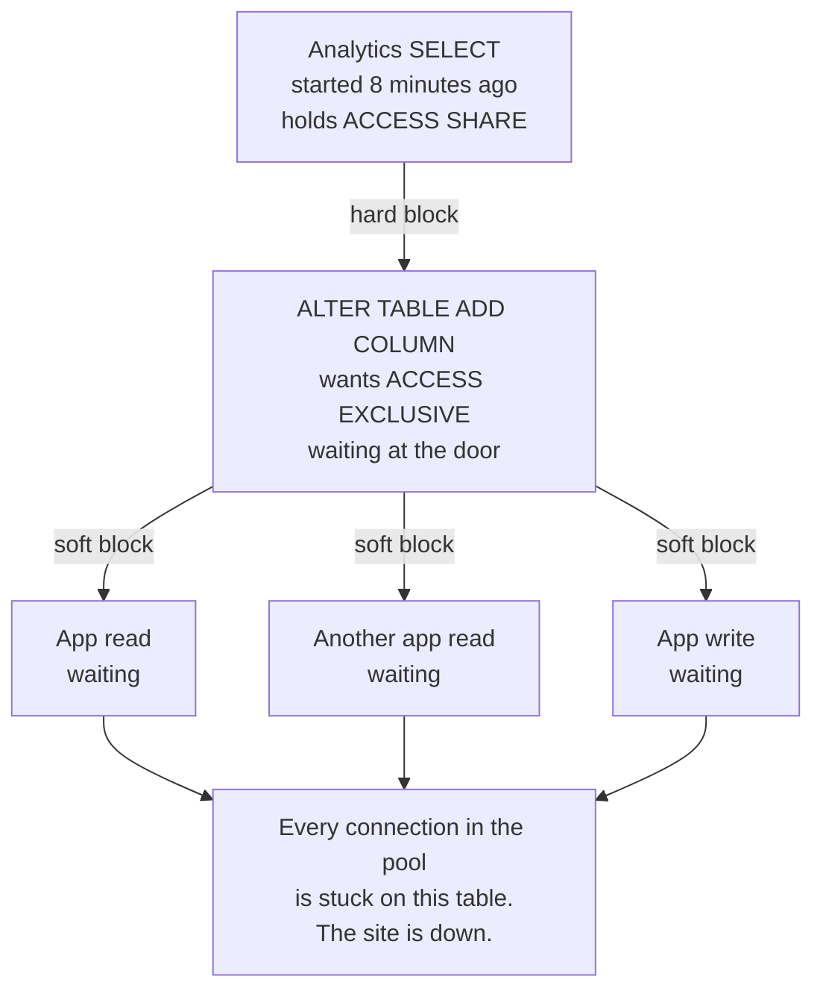
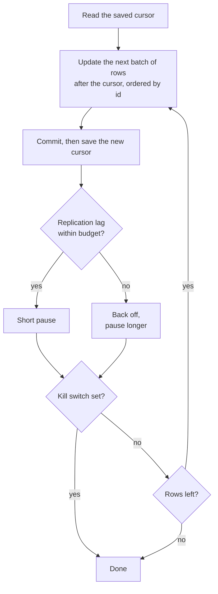
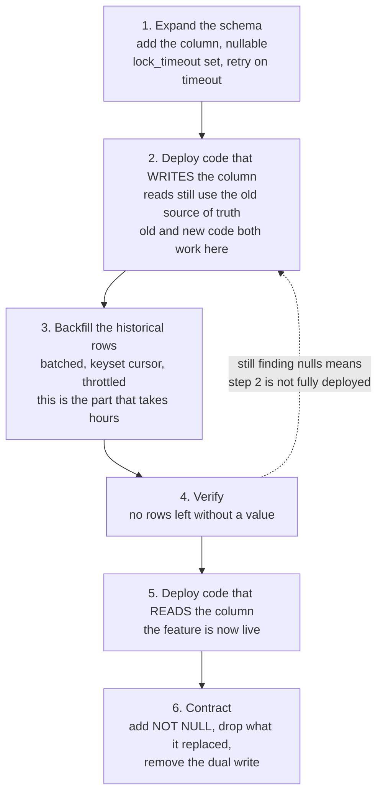

The question arrives about forty minutes into the interview, after the easy part is over.

"You have a table with 250 million rows. It is the busiest table in the product, reads and writes, twenty four hours a day. Product wants a new field on it. You cannot take the site down, not for a minute, not at 3am. How do you add the column?"

Most people answer in four seconds, and the answer is right:

```sql
ALTER TABLE events ADD COLUMN source text;
```

On a modern [PostgreSQL](https://www.postgresql.org) that statement finishes in about a millisecond no matter how big the table is. Not one second. Not one minute. A millisecond, on 250 million rows.

And if you run it on a busy production table without doing anything else first, there is a very good chance the site goes down for ten minutes.

That gap, between a statement that takes a millisecond and an outage that takes ten minutes, is the entire question. The interviewer is not testing whether you know the syntax. They are testing whether you have ever watched it go wrong.

This post is the long answer. I have tried to write it so that someone who has never thought about database locks can follow every step, and so that someone who has can still find the parts that are easy to get wrong. Every claim that sounds surprising has a link to the documentation that backs it, because a lot of what gets repeated about this topic is either out of date by several major versions or was never true.

## First, what the question is actually asking

If you are newer to this, let me set the scene properly, because the numbers matter.

A **table** is a grid. Each **row** is one record, one event, one order, one user. Each **column** is one field that every row has. Adding a column means every row in the table now has one more slot.

**250 million rows** is a number worth sitting with for a second. If you could process a hundred thousand rows every second, which is optimistic for anything that writes, touching all of them still takes about forty minutes of continuous work. Storage is the same story: if each row is a modest 200 bytes, the table is around 50 GB before you count indexes.

**Live 24/7** means there is no quiet window. There is no 4am on a Sunday where you can take the table offline for forty minutes and nobody notices. Whatever you do has to happen while the table is being read and written the entire time.

So the question breaks into two very different problems that people constantly mash together:

1. **Making the column exist.** This turns out to be nearly free, if you know the rules.
2. **Putting a value in it for all 250 million existing rows.** This is the expensive part, and it is a completely separate job with completely different failure modes.

Almost every bad answer to this interview question is someone solving problem one and not noticing problem two exists. Almost every production outage from this operation is someone doing problem one carelessly.

Let us take them in order.

## Part one: making the column exist

### Why it is free

You would think that adding a column to a 250 million row table means rewriting 250 million rows to make room for the new slot. For a long time, in a lot of databases, that is exactly what happened, and that is where the folklore comes from.

Postgres does not do that. The [ALTER TABLE documentation](https://www.postgresql.org/docs/current/sql-altertable.html) says it plainly:

> When a column is added with `ADD COLUMN` and a non-volatile `DEFAULT` is specified, the default value is evaluated at the time of the statement and the result stored in the table's metadata, where it will be returned when any existing rows are accessed. The value will be only applied when the table is rewritten, making the `ALTER TABLE` very fast even on large tables. If no column constraints are specified, NULL is used as the `DEFAULT`. In neither case is a rewrite of the table required.

Read that carefully, because it is doing something clever. The default is written down **once**, in the table's metadata. When Postgres later reads an old row that physically predates the column, it notices the row is too short, and hands back the stored default instead. The row on disk is never touched.

So both of these are fast on 250 million rows:

```sql
-- nullable, no default: nothing to store, nothing to rewrite
ALTER TABLE events ADD COLUMN source text;

-- constant default, even with NOT NULL: stored once in the catalog
ALTER TABLE events ADD COLUMN status text NOT NULL DEFAULT 'pending';
```

That second one surprises people who learned this before 2018. It became fast in [PostgreSQL 11](https://www.postgresql.org/docs/release/11.0/), whose release notes list it as:

> Allow `ALTER TABLE` to add a column with a non-null default without doing a table rewrite (Andrew Dunstan, Serge Rielau). This is enabled when the default value is a constant.

Worth saying out loud: **if a constant default is all you need, you are already done.** There is no backfill. There is no worker. The whole second half of this post does not apply to you. A surprising number of teams build an elaborate batching apparatus for a case that one line of SQL already handled.

### The versions of this that are not free

The word doing the work in that quote is **constant**. The same documentation page lists what still forces a full rewrite:

> Adding a column with a volatile `DEFAULT` (e.g., `clock_timestamp()`), a stored generated column, an identity column, or a column with a domain data type that has constraints will cause the entire table and its indexes to be rewritten.

"Volatile" means the expression produces a different answer each time it runs. That is the trap, and it is an easy one to fall into because the syntax looks identical:

```sql
-- fast: one value, computed once, stored in the catalog
ALTER TABLE events ADD COLUMN region text NOT NULL DEFAULT 'unknown';

-- catastrophic: every row needs a DIFFERENT value, so every row must be written
ALTER TABLE events ADD COLUMN public_id uuid NOT NULL DEFAULT gen_random_uuid();
```

The second statement has to rewrite the table and all of its indexes, holding a lock the entire time. On 250 million rows that is not a migration, it is an outage with a progress bar you cannot see.

If you are on [PostgreSQL 18](https://www.postgresql.org/docs/current/ddl-generated-columns.html) or newer there is one more free option worth knowing. Generated columns now default to `VIRTUAL`, meaning the value is computed when it is read rather than stored on disk. Adding one is a catalog change:

```sql
-- computed on read, stored nowhere, so there is nothing to rewrite
ALTER TABLE orders ADD COLUMN total numeric GENERATED ALWAYS AS (qty * unit_price) VIRTUAL;
```

`STORED` generated columns are the opposite: the value lives on disk, so adding one rewrites everything.

So the rule for part one is short. **Nullable, or a constant default, or virtual generated: free. Anything computed per row: not free.**

### And now the part that takes the site down

Here is where the interview question actually lives.

Even the free version of `ALTER TABLE ADD COLUMN` needs a lock. Specifically it needs the strongest one Postgres has, called `ACCESS EXCLUSIVE`. The [locking documentation](https://www.postgresql.org/docs/current/explicit-locking.html) describes it as:

> Conflicts with locks of all modes [...] This mode guarantees that the holder is the only transaction accessing the table in any way.

**If you are new to locks**, here is the whole idea. A lock is a claim on a table that says what you are doing to it, so that two people cannot do incompatible things at the same time. Most claims get along fine. Any number of readers can read the same table simultaneously; their locks are compatible, so nobody waits. But a statement that changes the *shape* of the table needs everyone else out of the way for a moment, because it is about to change what the table even is.

Think of it as a room with one door. Readers can be in the room together, as many as you like. Someone who needs to move a wall has to wait until the room is empty.

Now, holding that lock is not the problem. The ALTER holds it for about a millisecond and lets go.

**Waiting for it is the problem.**

Imagine an analytics query started eight minutes ago and is still running. It is a plain `SELECT`, entirely harmless, and it holds the weakest lock there is. Your ALTER shows up wanting `ACCESS EXCLUSIVE`, which conflicts with that, so your ALTER gets in line at the door and waits.

Here is the part that catches people, and it is the single most important thing in this post. **Everyone who arrives after your ALTER also has to wait**, even though they only wanted to read, and even though the people already inside the room would have been perfectly happy to share with them.

This is not a bug and it is not folklore. It is written into the documentation for [`pg_blocking_pids`](https://www.postgresql.org/docs/current/functions-info.html):

> One server process blocks another if it either holds a lock that conflicts with the blocked process's lock request (**hard block**), or is waiting for a lock that would conflict with the blocked process's lock request and is ahead of it in the wait queue (**soft block**).

That second clause is the queue. Your waiting ALTER soft-blocks every query that arrives behind it. And in a web application, "every query that arrives behind it" means every request that touches your busiest table.



Follow the timeline. Your millisecond migration waits behind an eight minute query. Traffic piles up behind your migration. Your connection pool has some finite number of connections, and every one of them is now parked on a query that cannot start. New requests cannot get a connection at all. Health checks fail. The load balancer starts pulling instances. Someone pages you.

The `ALTER TABLE` was never slow. It never even ran.

And the thing holding the door does not have to be a slow query. There is a worse version: a connection that ran one quick statement, never committed, and went idle. Postgres holds a transaction's locks until the transaction ends, so an `idle in transaction` session holds the door open indefinitely. Your migration is then waiting on a bug in some unrelated code path from three months ago, and no amount of staring at slow query logs will show it to you.

If you want to see the full lock model worked through end to end, this is a good deep dive:

[All Postgres Locks Explained, a deep dive by Hussein Nasser](https://www.youtube.com/watch?v=URwmzTeuHdk)

### The fix is two lines

You cannot stop long queries from existing. What you can do is refuse to stand in the queue.

```sql
SET lock_timeout = '3s';
ALTER TABLE events ADD COLUMN source text;
```

[`lock_timeout`](https://www.postgresql.org/docs/current/runtime-config-client.html) does exactly one job, and the documentation is precise about it:

> Abort any statement that waits longer than the specified amount of time while attempting to acquire a lock on a table, index, row, or other database object. [...] Unlike `statement_timeout`, this timeout can only occur while waiting for locks.

That distinction matters. `statement_timeout` limits how long a statement may *run*. `lock_timeout` limits how long it may *wait for the door*. For DDL, the wait is the dangerous part, so it is the wait you want to bound.

With this set, one of two things happens. Either the door is clear and your migration takes a millisecond, or it is not and your migration gives up after three seconds having blocked almost nothing. Nobody notices either outcome.

Then you simply try again:

```
attempt 1 -> lock not available, gave up after 3s, wait a bit
attempt 2 -> lock not available, gave up after 3s, wait a bit
attempt 3 -> acquired, column added, done
```

Retry with a growing pause between attempts. The pause matters more than it looks: if you retry instantly and aggressively you spend all day fighting for the door and you make the contention worse. Give the long query time to actually finish.

Three practical notes that go with this.

**Look before you leap.** Query [`pg_stat_activity`](https://www.postgresql.org/docs/current/monitoring-stats.html) for long-running transactions on the table first. If something has been open for eleven minutes, you already know your migration is going to fail, and you can go find out what that thing is rather than poking the database.

**Do not let your migration tool wrap it in one big transaction.** Many migration frameworks run every statement in a run inside a single transaction so the whole thing rolls back cleanly. That is a good default and it is wrong here. Locks are held until the transaction commits, so an `ACCESS EXCLUSIVE` taken by statement one is held until statement twenty finishes. A one millisecond lock becomes a four minute lock because it is sharing a transaction with something slow. Most tools have an opt-out for exactly this reason; find yours and use it.

**Consider a linter.** [Squawk](https://squawkhq.com) and [strong_migrations](https://github.com/ankane/strong_migrations) both read migrations and refuse the dangerous patterns before they reach production. This is the kind of knowledge that is much better encoded in CI than in one person's memory.

That is part one. The column exists, and nobody noticed. Now for the half of the problem that actually takes time.

## Part two: putting a value in 250 million rows

You only get here when the value has to be computed **per row**: derived from other columns, looked up in another table, generated fresh. A constant does not need this. Go back and re-read the fast default section if you are not sure which case you are in, because the difference is one line of SQL against several hours of work.

### The one statement you must not run

The obvious thing:

```sql
UPDATE events SET source = derive(payload);
```

Do not do this. Not because it is slow, though it is, but because of what it does to the rest of the database.

**If you are new to this, here is why an UPDATE is so much more expensive than it looks.** Postgres never overwrites a row in place. It writes a whole new version of the row and leaves the old one behind, because other transactions might still need to see the old one. The [vacuuming documentation](https://www.postgresql.org/docs/current/routine-vacuuming.html) states it directly:

> In PostgreSQL, an `UPDATE` or `DELETE` of a row does not immediately remove the old version of the row. This approach is necessary to gain the benefits of multiversion concurrency control (MVCC): the row version must not be deleted while it is still potentially visible to other transactions.

Those old versions are called dead rows, and a background process called autovacuum eventually reclaims the space. Until it does, they sit there taking up disk. The same page:

> The space it occupies must then be reclaimed for reuse by new rows, **to avoid unbounded growth of disk space requirements**.

Now apply that to one statement covering 250 million rows. You have created 250 million new row versions and 250 million dead ones. The table roughly doubles on disk. All of it happened inside a single transaction, which means:

- Autovacuum cannot reclaim any of it until the transaction ends, because those old versions are still potentially visible.
- Every change is written to the write-ahead log, which is what replicas read to stay in sync. You have just dumped tens of gigabytes into it at once, and every replica is now minutes or hours behind.
- The transaction holds row locks the entire time, so anything trying to update those rows waits.
- If it fails at 90 percent, or somebody kills it, all of that work is thrown away and rolled back. Then you start again.

You have not caused a lock queue like part one. You have caused something slower and messier: a database that is bloated, replicas that are lagging, and a vacuum that is trying to catch up while production traffic continues.

### So: batches. But do the arithmetic first

The right instinct is exactly the one most people have. Do it in small pieces. Update some rows, commit, pause a moment, do the next lot, keep going until the table is covered.

The instinct is correct. The place people go wrong is picking the numbers without multiplying them out, and the multiplication is brutal, because **the pause happens once per batch, and small batches mean an enormous number of batches**.

| Rows per batch | Batches to cover 250M | Pausing 1s each | Pausing 5s each | Pausing 10s each |
| --- | --- | --- | --- | --- |
| 1,000 | 250,000 | 2.9 days | 14.5 days | 29 days |
| 10,000 | 25,000 | 6.9 hours | 1.4 days | 2.9 days |
| 50,000 | 5,000 | 1.4 hours | 6.9 hours | 13.9 hours |
| 100,000 | 2,500 | 42 minutes | 3.5 hours | 6.9 hours |

That is pause time alone. The actual work of updating the rows is on top of it.

Look at the top row. Small batches with a comfortable pause feels like the safe, considerate choice, and it produces a job that runs for **weeks**. That is not a safe migration, it is a migration that never finishes. And a backfill that runs for weeks is genuinely worse than one that runs for hours, because for that entire time you are living in a half-migrated state: you cannot ship the code that depends on the column, you cannot add the constraint, and every deploy in between has to keep the unfinished migration alive.

Reasonable ground is a batch in the tens of thousands with a pause measured in fractions of a second. That lands you at a few hours, which is something you can start in the morning and watch.

But there is a better answer than picking numbers at all.

### Make the pause a feedback loop, not a constant

A fixed pause is a guess about how busy the database is, and it is a guess you have to make in advance, once, for a job that will run for hours across changing traffic.

It is wrong at 3am, when the database is idle and your worker is crawling for no reason, wasting the quietest window you will get. It is wrong at peak, when the pause you picked is not nearly enough and you are hurting users anyway.

So do not guess. Measure something and react to it.

The best single signal is **replication lag**: how far behind your replicas are. It is a good choice because it aggregates the thing you actually care about, which is how much write pressure you are adding, better than CPU does. Postgres exposes it in [`pg_stat_replication`](https://www.postgresql.org/docs/current/monitoring-stats.html), where the `replay_lag` column is documented as:

> Time elapsed between flushing recent WAL locally and receiving notification that this standby server has written, flushed and applied it.

```sql
SELECT max(replay_lag) FROM pg_stat_replication;
```

After each batch, read it. Under your threshold, keep moving. Over it, back off until it recovers. Now the worker sprints when the database is quiet and slows itself down under load, and you never had to predict traffic in advance. It also self-corrects when something unrelated starts hammering the database halfway through your run, which a fixed pause cannot do.

If you do not run replicas, the same idea works on whatever you do have: active connection count, transaction latency, replication lag reported by your managed provider. The principle is what matters. **Throttle on a measurement, not on a number you picked yesterday.**

### Never paginate with OFFSET

This one quietly ruins the whole plan, and it looks so reasonable that it survives code review constantly.

```sql
-- do not do this
UPDATE events SET source = derive(payload)
WHERE id IN (SELECT id FROM events ORDER BY id LIMIT 25000 OFFSET 249000000);
```

`OFFSET` does not skip ahead. Postgres has to walk through and throw away all 249 million rows to reach the ones you asked for. Batch one is instant. Batch ten thousand is agony. The total work is quadratic, and from the outside it looks like the database is progressively degrading for no reason, when really it is your own loop getting slower every hour.

Walk the primary key instead, remembering where you got to. If your ids are dense integers, the simplest form is to march a window along the key range:

```sql
UPDATE events
SET source = derive(payload)
WHERE id > :cursor
  AND id <= :cursor + 25000
```

That is cheap because the index takes you straight to the range. Its one weakness is that ids are often not dense: delete enough rows, or use a sequence that skips, and some windows contain 25,000 rows while others contain three. If you want each batch to be a predictable size regardless, take the ids in order and remember the last one you touched. This is the pattern usually called keyset pagination:

```sql
WITH batch AS (
  SELECT id FROM events
  WHERE id > :cursor
  ORDER BY id
  LIMIT 25000
)
UPDATE events e
SET source = derive(e.payload)
FROM batch b
WHERE e.id = b.id
RETURNING e.id;
```

The largest id you get back becomes the next cursor. Every batch costs the same, whether it is the first or the ten thousandth.

There is a related trap worth naming. It is tempting to loop on `WHERE source IS NULL LIMIT 25000`, since that is literally the remaining work. Resist it. As the backfill progresses, finding the rows that are still null means scanning through everything you have already finished, and you are back to a loop that gets slower every hour. Walk the primary key.

### Every batch is its own transaction, which means the job must be resumable

This is what makes the batching worth anything. If you wrap the whole loop in one transaction you have rebuilt the single giant `UPDATE` with extra steps: nothing is committed, nothing can be vacuumed, the write-ahead log grows without bound.

So each batch commits on its own. Which means the job is not atomic. Which means it will, at some point, stop halfway.

Plan for that rather than hoping. Three properties make a backfill worker survivable:

**Store the cursor durably**, in a table, not in the worker's memory. The process will be restarted by a deploy, an autoscaler, an OOM kill, or somebody's laptop closing. It should pick up at batch 7,431, not at zero.

**Make each batch idempotent.** Re-running a batch that already succeeded must be harmless. If you crash between committing the update and saving the cursor, you will re-run it, and that has to be fine.

**Give it an off switch.** A flag the worker checks between batches, so you can stop it without killing the process mid-transaction. You will want this at 2pm on a Tuesday when something unrelated catches fire and you need to take pressure off the database immediately.



### The hole that makes a backfill never finish

Here is the mistake that is invisible until you are three hours in and confused.

Your worker is patiently walking 250 million rows. That takes hours. During those hours, the application keeps doing what it does: inserting new rows, updating old ones.

If the application does not know about the new column yet, all of those writes leave it null. New rows arrive null. Worse, rows *behind* your cursor, ones you already carefully filled in, get updated by ordinary product traffic and go back to null.

You finish the backfill. You count the nulls. There are still nulls. You run it again. There are still nulls. You are chasing a moving target, and you will keep chasing it forever, because the target moves for exactly as long as the application is running.

So the order is fixed, and it is not the order most people reach for:

1. Add the column, nullable.
2. **Deploy the application code that writes it.** Every insert and every update now fills it in. Reads still use the old source of truth, so this deploy changes nothing that a user can see.
3. **Now** start the backfill worker. It is filling a set that only ever shrinks.
4. Verify there are no nulls left.
5. Deploy the code that reads the new column.
6. Tighten the constraints and clean up.

Step two before step three is the whole trick. A `DEFAULT` on the column covers plain inserts, but it will not cover a value derived from other columns and it will not cover updates. The application has to know.

### Why the code and the schema can never ship together

There is a reason this dance has so many steps, and it is worth being explicit about it because it generalises far beyond adding a column.

When you deploy, there is a window, usually a few minutes, where **old code and new code are both running against the same database**. That is what a rolling deploy is. So every intermediate state has to be one that both versions can survive.

This shape is usually called expand and contract. You expand the schema so that it supports both the old and the new way of doing things. You migrate across. Then you contract, removing the old way, only once nothing is using it.



One landmine belongs to this window specifically. If any code writes `INSERT INTO events VALUES (...)` without naming its columns, adding a column breaks that statement the instant the column appears, because the list of values no longer matches the number of columns in the table. Note what that means for timing: the break happens at step one, on code you did not touch, in the deploy where you thought you had changed nothing. Always name your columns explicitly, and it is worth checking what your ORM actually emits rather than assuming it does.

## Part three: tightening it up

The backfill finished. Every row has a value. Two jobs left, and both have a sharp edge.

### Making it NOT NULL without a full table scan

You want the database to guarantee the column is always populated from now on. The obvious statement is a trap:

```sql
-- reads all 250 million rows while holding ACCESS EXCLUSIVE
ALTER TABLE events ALTER COLUMN source SET NOT NULL;
```

To promise there are no nulls, Postgres normally checks, and checking means reading every row. Under the strongest lock. On 250 million rows that is minutes of the exact outage you spent this whole post avoiding.

There is a documented way around it, and it is my favourite detail in this entire topic. From the [ALTER TABLE docs](https://www.postgresql.org/docs/current/sql-altertable.html):

> `SET NOT NULL` may only be applied to a column provided none of the records in the table contain a `NULL` value for the column. Ordinarily this is checked during the `ALTER TABLE` by scanning the entire table [...] however, **if a valid `CHECK` constraint exists (and is not dropped in the same command) which proves no `NULL` can exist, then the table scan is skipped**.

So you give Postgres the proof separately, using a lock that does not block anybody, and then the real statement has nothing left to do.

```sql
-- 1. Declare the rule without checking it. Instant: no scan happens.
ALTER TABLE events
  ADD CONSTRAINT events_source_not_null
  CHECK (source IS NOT NULL) NOT VALID;

-- 2. Now check it. This DOES scan the table, but under a gentle lock
--    that does not block reads or writes, so it can take as long as it likes.
ALTER TABLE events VALIDATE CONSTRAINT events_source_not_null;

-- 3. Instant: a valid CHECK already proves it, so the scan is skipped.
ALTER TABLE events ALTER COLUMN source SET NOT NULL;

-- 4. The CHECK is now redundant. Drop it.
ALTER TABLE events DROP CONSTRAINT events_source_not_null;
```

The trick is step two, and the docs are explicit about why it is safe:

> The main purpose of the `NOT VALID` constraint option is to reduce the impact of adding a constraint on concurrent updates. [...] Hence, validation acquires only a `SHARE UPDATE EXCLUSIVE` lock on the table being altered.

`SHARE UPDATE EXCLUSIVE` does not conflict with reads or writes. The long scan happens with production traffic running straight through it. You have moved the expensive work out from under the blocking lock, which is the same move as the whole rest of this post.

Worth knowing which version you are on. This optimisation arrived in [PostgreSQL 12](https://www.postgresql.org/docs/release/12.0/), listed there as "Allow `ALTER TABLE ... SET NOT NULL` to avoid unnecessary table scans (Sergei Kornilov). This can be optimized when the table's column constraints can be recognized as disallowing nulls." On 11 and earlier the scan happens regardless and the trick above buys you nothing.

### Indexing the new column

If queries are going to filter on the new column, it needs an index. The plain statement locks out writes for the entire build, which on a table this size is a long time.

Use the concurrent form. The [CREATE INDEX documentation](https://www.postgresql.org/docs/current/sql-createindex.html):

> PostgreSQL will build the index without taking any locks that prevent concurrent inserts, updates, or deletes on the table; whereas a standard index build locks out writes (but not reads) on the table until it's done.

```sql
CREATE INDEX CONCURRENTLY idx_events_source ON events (source);
```

You pay for that with three caveats the same page spells out, and all three matter operationally.

**It is slower overall.** It has to do more work:

> When this option is used, PostgreSQL must perform two scans of the table, and in addition it must wait for all existing transactions that could potentially modify or use the index to terminate.

That waiting clause is the one that bites. A single long-running transaction anywhere can stall the index build for as long as it lasts.

**It cannot run inside a transaction block.** Stated flatly: "A regular `CREATE INDEX` command can be performed within a transaction block, but `CREATE INDEX CONCURRENTLY` cannot." Another reason your migration tool must not wrap this run in one transaction.

**It can fail and leave a mess behind.**

> If a problem arises while scanning the table [...] the `CREATE INDEX` command will fail but leave behind an "invalid" index. This index will be ignored for querying purposes because it might be incomplete; however it will still consume update overhead.

That is the worst of both worlds: an index that answers no queries but slows down every write. It does not clean itself up. Check for it after any failure and drop it before retrying, because otherwise it sits there quietly costing you forever.

```sql
-- find indexes that failed a concurrent build
SELECT indexrelid::regclass FROM pg_index WHERE NOT indisvalid;
```

## The things that bite you that nobody warns you about

Everything above is the main path. These are the ones that turn a smooth migration into a confusing afternoon.

### Your read replicas are not safe

This one surprises almost everybody, and it undermines the assumption that a metadata-only change is harmless.

Schema changes travel to replicas through the write-ahead log, and when a replica replays that record it has to take the same `ACCESS EXCLUSIVE` lock on its own copy of the table. The [hot standby documentation](https://www.postgresql.org/docs/current/hot-standby.html) is direct about the consequence:

> Access Exclusive locks taken on the primary server, including both explicit `LOCK` commands and various DDL actions, conflict with table accesses in standby queries.

The replica then has to choose between two bad options: stop applying changes and fall behind, or cancel the query that is in the way. Which one it does is governed by `max_standby_streaming_delay`, and once that budget is exhausted:

> Conflicting queries will be canceled once it has taken longer than the relevant delay setting to apply any newly-received WAL data.

So your perfectly safe, millisecond, metadata-only `ALTER TABLE` on the primary reaches out and kills the long-running analytics query on your replica. Zero downtime on the primary, and the reporting dashboard fell over. If your replicas serve anything a human is looking at, know this before you run the migration rather than during.

### Watch vacuum while the backfill runs

Back to those 250 million dead row versions. The pauses between batches genuinely help here, because that is when autovacuum gets to work. But "it should be fine" is not a plan. Watch it.

If autovacuum falls behind, the dead rows accumulate faster than they are reclaimed, the table bloats on disk, and queries slow down because they are reading more pages to find the same data. You will have traded a schema problem for a storage problem, and the storage problem outlives the migration.

On a big table it is often worth making autovacuum more aggressive on just that table for the duration, then putting it back. Per-table settings exist precisely so you do not have to change the global behaviour to get through one bad afternoon.

### There is a cheaper kind of update, and you can aim for it

One detail that explains a lot of the cost. Postgres has an optimisation called [heap-only tuples](https://www.postgresql.org/docs/current/storage-hot.html), where an update can avoid touching the table's indexes entirely. It applies when two conditions hold: the update does not change any column that an index references, and there is enough free space on the same page for the new version of the row.

The second condition is the one you can influence. On a table packed full there is no room on the page, so the new row version goes elsewhere and every index on the table has to be updated to point at it. That is a large part of why backfilling a wide, heavily indexed table is so much more expensive than the row count suggests.

The docs note the lever:

> You can increase the likelihood of sufficient page space for HOT updates by decreasing a table's `fillfactor`.

You can watch whether it is working. `pg_stat_all_tables` has an `n_tup_hot_upd` column, documented as "Number of rows HOT updated. These are updates where no successor versions are required in indexes." Compare it against the total update count during your backfill and you will know immediately which regime you are in.

### One worker, not five

It is tempting to speed the backfill up by running several workers on different key ranges. It can be made to work, and it is worth being clear-eyed about the cost: you now need range assignment, coordination so two workers never overlap, and a kill switch that stops all of them.

More importantly, parallelism does not usually help here, because the constraint is almost never your worker's CPU. It is how much write pressure the database can absorb without hurting production. Five workers do not raise that ceiling. They just reach it five times faster and then you throttle all five.

Start with one worker and a good throttle. Add parallelism only if you have measured that the database is bored.

## What about MySQL and everything else

The principles above are not specific to Postgres. Every transactional database has to answer the same three questions: does adding a column rewrite the data, what does it lock while it does, and how do you fill in the old rows. Only the answers differ.

[MySQL](https://www.mysql.com) with InnoDB has its own version of the fast path, called instant DDL. The [online DDL documentation](https://dev.mysql.com/doc/refman/8.0/en/innodb-online-ddl-operations.html) covers the details, and there are two worth carrying with you.

**Say the algorithm out loud.**

```sql
ALTER TABLE events ADD COLUMN source VARCHAR(64), ALGORITHM=INSTANT;
```

If MySQL cannot do it instantly, this errors out and tells you why rather than silently falling back to copying the entire table while you watch. Making the failure loud is worth a great deal at 11pm.

**Instant columns are a finite resource.** Each instant add or drop creates a new row version, and the maximum is 64. Past that, the operation is rejected outright and the table must be rebuilt to reset the counter. You can check where you stand in `INFORMATION_SCHEMA.INNODB_TABLES.TOTAL_ROW_VERSIONS`. It is a limit most people never approach, and a genuinely baffling error message if you are the person who does.

When the change is one MySQL cannot do instantly, the established tools are [gh-ost](https://github.com/github/gh-ost) and [pt-online-schema-change](https://docs.percona.com/percona-toolkit/pt-online-schema-change.html). Both build a new copy of the table and swap it in. The interesting difference is how they keep the copy current: pt-online-schema-change installs triggers, which means every production write now does extra synchronous work; gh-ost reads the replication stream instead, which keeps that cost off the write path. For a table that is genuinely hot 24/7, that difference is the reason gh-ost exists.

## The ninety second version

If you are actually sitting in the interview, this is the shape of the answer:

"First I would ask which engine and which version, because it changes the answer completely. On Postgres 11 or newer, adding a nullable column, or one with a constant default, is a catalog change. It is milliseconds regardless of row count, and there is nothing to backfill.

The risk is not the statement, it is the lock. It needs `ACCESS EXCLUSIVE`, and while it waits behind some long-running query, every new query queues behind it, including plain reads that would have been fine. That is how a one millisecond migration takes the site down. So I would set `lock_timeout` to a few seconds and retry, and make sure the migration is not inside a long transaction.

If the value has to be computed per row, that is a separate job. Deploy the code that writes the column first, so new traffic is already correct, then backfill the history in batches walked by primary key, each batch its own transaction, throttled on replication lag rather than a fixed sleep, with the cursor stored so it can resume.

Then `NOT NULL` at the end via a `NOT VALID` check constraint that I validate under a gentle lock, so the final `SET NOT NULL` skips the table scan. And any index goes in with `CREATE INDEX CONCURRENTLY`.

The last thing I would say is that if adding a column to this table is a whole project, that is the schema telling us something, and I would want to talk about partitioning it."

That last sentence is the one that turns a good answer into a conversation, so let me finish there.

## When the real answer is "we should not be doing this"

Sometimes the honest answer to "how do we add a column to this table" is that the table should not be shaped like this.

**Partition it.** [Declarative partitioning](https://www.postgresql.org/docs/current/ddl-partitioning.html) splits one enormous table into many smaller ones behind a single name, usually by date range for something like an events table. Suddenly most maintenance is per-partition. Dropping data that aged out becomes dropping a partition instead of a `DELETE` of 40 million rows. Backfilling becomes a job you can run one partition at a time, resume cleanly, and reason about. The cost is real: partitioning an existing 250 million row table is itself a large migration, and the partition key constrains your query patterns forever. But it is the difference between this being hard once and hard every time.

**Put the column somewhere else.** If the new field is only needed by one feature, a separate table keyed by the same id costs you a join but makes the schema change completely trivial. It is unfashionable and it is often correct, particularly for a field that is sparse or that only one part of the product ever reads.

**Reach for JSONB carefully.** A JSONB column absorbs new attributes without any migration at all, which sounds like it solves this problem permanently. It does not. It moves the problem: you lose column-level constraints, the query planner's statistics get much worse, and validation moves from the database into application code where it is easier to forget. It is a good tool for genuinely sparse, genuinely variable attributes. It is a bad tool for a field that every row will eventually have, which is what you want a column for.

None of these are free. That is the point. The reason the interview question is a good one is that "add the column" is only the first of three or four decisions, and the interesting engineer is the one who notices the others.

---

If you want to go deeper, two write-ups I would send anyone: [GoCardless on the hard parts of zero-downtime Postgres migrations](https://gocardless.com/blog/zero-downtime-postgres-migrations-the-hard-parts), which is honest about the cases that stay ugly, and [Postgres.ai on lock_timeout and retries](https://postgres.ai/blog/20210923-zero-downtime-postgres-schema-migrations-lock-timeout-and-retries), which goes further into the retry strategy than I have here.

And if you have run one of these and hit something I have not covered, I would genuinely like to hear about it. There is a comment box below.
