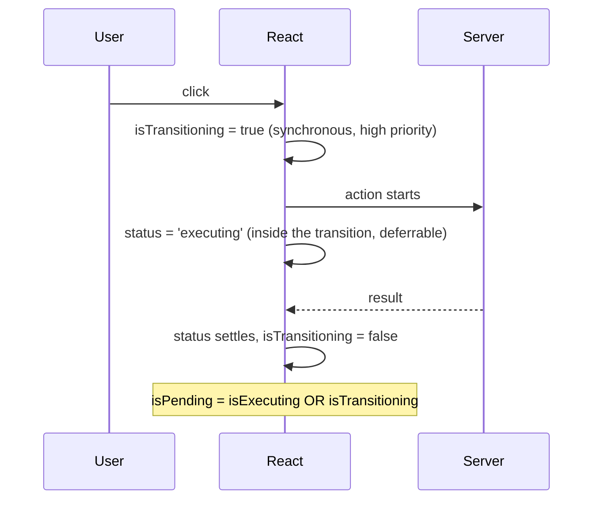

The bug report was one line and a screen recording: "it deletes twice sometimes".

The recording showed exactly what you would guess. Click Delete. Nothing visible happens. Click again, because nothing happened. Two requests, two deletions, and on one of them a second row gone that nobody meant to touch.

The gap was tiny. Maybe two frames. But a button that does not acknowledge a click is a button people click again, and ours was not [idempotent](term:idempotent) enough to survive that.

So we made it respond instantly, with a boolean we set ourselves. It worked. It was also a worse copy of a flag the library already returned, and I did not understand why the built-in one had looked slow until I went and read the source.

## The state nobody needed

Here is the shape almost everyone writes first:

```tsx
const [pending, setPending] = useState(false);
const { execute, status } = useAction(deleteThing, {
  onSettled: () => setPending(false),
});
const loading = pending || status === 'executing';
// onClick: () => { setPending(true); execute(id); }
```

Three pieces of state describing one fact. A manual flag, a status string, and a derived boolean to reconcile them. The `onSettled` exists only to reset the flag, and if it ever fails to fire the button is disabled forever.

The instinct behind it is sound, though, and worth taking seriously. Driving the button off `status === 'executing'` alone genuinely does feel late. People were not imagining it.

## Why the obvious flag feels late

To explain this I need one idea: the [transition](term:transition).

React splits updates into urgent and non-urgent. A character appearing as you type is urgent, because 100ms of delay feels broken. Re-rendering a heavy list because of that character is not. React may keep the old list on screen while it works, which is what keeps typing smooth.

The ordinary version: a kitchen with one chef. Somebody asks for a glass of water, somebody else orders three courses. The water goes first, not because it was ordered first, but because making it wait would be absurd.

[`useTransition`](https://react.dev/reference/react/useTransition) is how you say "this is the three courses". Your mutation runs inside one, which is what keeps the page responsive while it is in flight.

Without it, a mutation that triggers an expensive re-render blocks the main thread, so the button cannot repaint as disabled until the work finishes. The transition is what buys you the chance to show anything at all. This is the same budget [interaction latency](https://web.dev/articles/inp) is measured against, and 200ms is roughly where people start clicking twice.

Now the lag. `status` is set **inside** the transition callback, so it is part of the deferrable work. React can legitimately hold it. The spinner is stuck behind the three courses.



Read that middle section again. Two flags describe the same request and they become true at different moments.

## The flag React already gives you

React hands back a separate boolean that flips **synchronously**, the instant you call `startTransition`:

```tsx
const [isTransitioning, startTransition] = useTransition();
// true immediately, before any re-render is scheduled
```

That flag exists precisely so you can paint a spinner without waiting. It is high [priority](term:render-priority) by design.

`next-safe-action` combines the two:

```js
isExecuting: status === 'executing',
isPending:   status === 'executing' || isTransitioning,
```

So `isPending` is true the moment you click and stays true until the action settles. Which is exactly what the manual `useState` was faking, less reliably:

```tsx
const { execute, isPending } = useAction(deleteThing, {
  onSuccess: () => toast.success('Deleted'),
});
// onClick: () => execute(id)   disabled={isPending}
```

No `useState`, no `onSettled`, no derived boolean.

The stuck-disabled case is the real bug the manual version ships with, and it is worth dwelling on. The reset lives in a callback. Anything that stops the callback firing, an unmount mid-flight, an early return, a throw in a sibling handler, leaves a button that can never be clicked again. The library flag is derived from state React owns, so there is nothing to forget to reset.

## Why the two flags exist at all

If `isPending` is better, why ship `isExecuting` too? Because they answer different questions, and swapping them produces a different bug.

`isPending` means "something is happening, do not let them click again". That is a button question.

`isExecuting` means "the server call is genuinely in flight". That is a data question. Use it for progress about the request itself, or to decide whether a subscription is live. Drive a progress bar off `isPending` and it lights up during the transition before any request exists, which is honest for a button and a lie for a progress bar.

The rule I use: **buttons take `isPending`, anything describing the request takes `isExecuting`.**

## Where this stops being enough

Two boundaries, and the second is the one interviewers reach for.

`isPending` is about the transition, not the outcome. It goes false when the action settles, and settling includes settling with a `serverError`. A button watching only `isPending` re-enables itself after a failure and shows no sign anything went wrong, so you still need the error branch. Fast and silently broken is worse than slow.

The second is [revalidation](https://nextjs.org/docs/app/api-reference/functions/revalidatePath). If your action calls `revalidatePath`, the mutation finishing and the screen updating are two different moments. `isPending` covers the first. The fresh data arrives after, and in between, the row you just deleted is still sitting there. That gap is where [`useOptimisticAction`](https://next-safe-action.dev/docs/guides/hooks) and [`useOptimistic`](https://react.dev/reference/react/useOptimistic) earn their place: show the expected result at once, roll it back if the server disagrees.

Knowing that "pending" and "consistent" are different states is most of what separates a UI that feels fast from one that merely has a spinner.

## The short version

- Never add a manual pending `useState`. You are re-implementing [`startTransition`](https://react.dev/reference/react/startTransition)'s flag, worse, and you own the reset bug.
- `status === 'executing'` is set inside the transition, so React may defer it and the button looks frozen.
- `isTransitioning` flips synchronously on call, by design, so a spinner can paint at once.
- `isPending` is the union of the two. Drive button and disabled state off it.
- Use `isExecuting` when you mean the request specifically, not the interaction.
- `isPending` going false means the action settled, not that it succeeded and not that the screen caught up. Handle errors, and reach for optimistic state when the revalidation gap shows.
