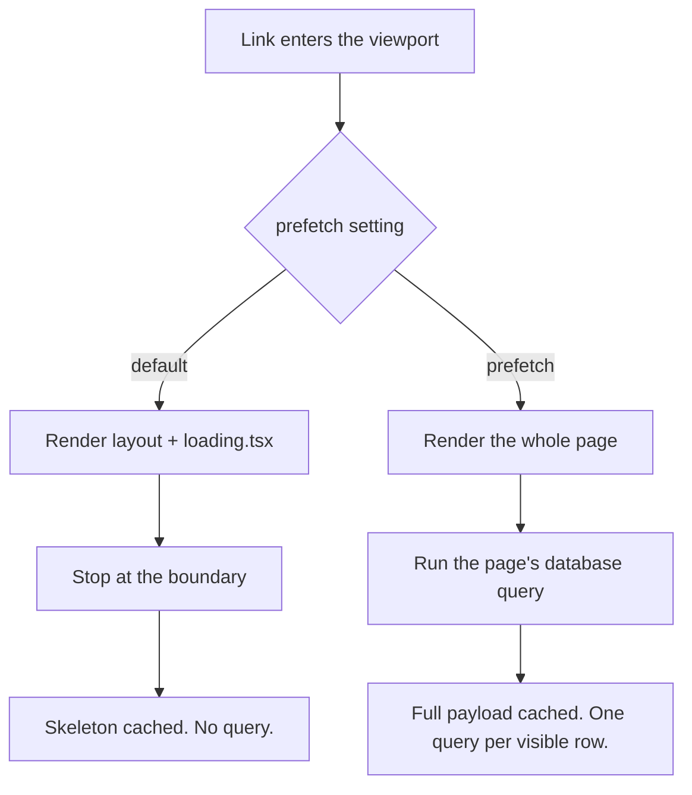

Nearly every product has a page shaped like this one. A list of records, one row each, and clicking a row opens it. Ours was orders, about twenty to a screen. It had worked for a year.

Then a ticket arrived from someone who works by keyboard rather than mouse. They could not reach the rows at all. Pressing Tab jumped from the search box straight to the footer, skipping every order on the page.

The cause was ordinary. The rows were `<div>`s, and a `div` is a plain box. The browser has no reason to think you can go anywhere by pressing one, so it does not stop there, and the click handler we had attached to make it navigate is invisible to a keyboard.

So I swapped each row for a real link. Correct fix, about a minute of work.

Clicking a row got faster, noticeably. The list page itself got slower: scrolling went from smooth to a stutter, and requests to that route roughly tripled.

One change, two things moving in opposite directions. Then I reached for the obvious fix and made it four times worse.

## What a prefetch actually is

When a [`<Link>`](https://nextjs.org/docs/app/api-reference/components/link) scrolls into view, Next quietly asks the server for the page behind it before you click. If the click comes, the answer is already in memory and the transition is instant. It uses the browser's [intersection observer](https://developer.mozilla.org/en-US/docs/Web/API/Intersection_Observer_API), so "in view" is literal.

What comes back is not HTML. It is an [RSC payload](term:rsc-payload): a compact description of the rendered tree that the browser turns into UI without a full page load.

Here is the part that decides everything else. Picture a restaurant. Laying a table is quick: cutlery, glasses, a menu. Cooking is the expensive bit.

A prefetch, by default, **lays the table**. It does not cook.

That one sentence is the whole post. Everything below is consequences.

## The setting that is not what you think

`prefetch` has three settings and the default is not `true`. It is the single most misread prop in the App Router, and the naming is why: it reads like a switch that is off.

| Setting | What it fetches for a [dynamic route](term:dynamic-route) |
| --- | --- |
| omitted (the default) | Down to the [loading boundary](term:loading-boundary) only. The skeleton. No data. |
| `prefetch` or `prefetch={true}` | The whole route, data included. |
| `prefetch={false}` | Nothing on scroll. |

Writing bare `prefetch` means `prefetch={true}`. You are not enabling something that was off. You are replacing a cheap default with an expensive one.

The reason the default stops is usually described as if the client were being clever. It is not. The server is refusing:



The layout and skeleton do not depend on the request, so they are safe to build and cache. The page body reads params, cookies and the database, so the server declines to run it for a page nobody has opened. Nothing is guessed. Work is simply not done on spec.

That boundary is a [`<Suspense>`](https://react.dev/reference/react/Suspense) wrapper, which is also why a skeleton can appear before the data exists.

## Why turning it on made things worse

My list showed about twenty rows at a time. Adding `prefetch` meant every visible row fired a full detail render in the background, each with its own query.

Twenty rows on screen, twenty page renders. Scrolling produced more. The detail pages got faster, and the list page, now competing with twenty background renders for the same [connection pool](term:connection-pool), got slower.

That is the trap in one line. The prop reads like "make it fast", and on a list it slows the page you are looking at to speed up a page you may never open.

Worse, the cost is not fixed. It scales with your data, so it is smallest on the day you measure it:

```tsx
// Twelve orders today. A hundred and twenty next quarter.
// With `prefetch`, every visible row is a query.
{orders.map((o) => (
  <Link key={o.id} href={`/orders/${o.id}`} prefetch>
    {o.reference}
  </Link>
))}
```

This is the shape of a whole family of performance bugs: the thing that made it slow was not a mistake, it was a good idea applied to an unbounded set.

## Bounded or unbounded

Here is the test I use now, and it has not been wrong yet.

**Could this set of links ever hold a hundred more, suddenly?**

If yes, it is unbounded. Anything driven by rows in a database is unbounded: orders, users, invoices, search results, comments. Twelve today, a hundred and twenty after a good quarter, and nobody files a ticket saying "we grew". Keep the default. The skeleton prefetch stays cheap no matter how the data grows, and a skeleton plus a fast query already feels instant.

If no, it is bounded. A dashboard's tiles, a settings menu, the top-level nav. A fixed set that you control and that will not suddenly become a hundred, where each target is somewhere a person actually intends to go. Warming the full route costs a handful of requests and makes the click genuinely instant:

```tsx
// Fixed set of six. Safe to warm fully.
<Link href="/settings/billing" prefetch>Billing</Link>
```

The rule in one line: **bounded sets may cook, unbounded sets only lay the table.**

There is a second-order effect worth knowing for an interview. Prefetched payloads are held in the [client router cache](https://nextjs.org/docs/app/getting-started/caching), so full-route prefetching on a long list does not only cost server work, it also fills memory with pages the reader never opened. On a phone, that is not free either.

## The part prefetch cannot fix

I reverted to the default. The list went smooth again, and the detail page still took two seconds. The skeleton appeared instantly, then sat there.

This is the beat people skip, so let me be blunt. A skeleton hides latency. It does not remove it. If a two kilobyte response takes two seconds, the payload is not the problem and neither is the client cache. Something on the server is slow, and no [prefetching strategy](https://nextjs.org/docs/app/guides/prefetching) touches it.

The usual suspects, in the order I check them:

- A [cold start](term:cold-start). The function scaled to zero and has to boot before answering, which [Vercel documents](https://vercel.com/docs/functions/limitations) as expected behaviour rather than a fault.
- A sleeping database. Serverless Postgres like [Neon](https://neon.com/docs/introduction/scale-to-zero) scales to zero when idle and pays a wake cost on the first query.
- Queueing. Many prefetches and navigations at once contend for a small number of instances and connections.

The one-minute triage: run the same page against a warm local server. Fast locally and slow deployed means the remaining time is infrastructure, not components. The levers are warm instances, pooling and turning off scale-to-zero.

I spent a day in the front end before I checked. The database was asleep.

## The short version

- Only [`<Link>`](https://nextjs.org/docs/app/api-reference/components/link) prefetches. A [`router.push`](https://nextjs.org/docs/app/api-reference/functions/use-router) in an `onClick` fetches nothing ahead, so the click waits for the whole route cold.
- The default fetches the *shape* of the page, down to the [`loading.tsx`](https://nextjs.org/docs/app/api-reference/file-conventions/loading) boundary. Bare `prefetch` fetches the *page*, data and all.
- Ask whether the set could hold a hundred more, suddenly. Database-driven lists always could, so keep the default. Fixed menus cannot, so `prefetch` is fine there.
- Add a page-shaped `loading.tsx` to any dynamic route. That is what makes the cheap default worth having.
- If a tiny response is still slow behind the skeleton, stop editing components. Compare against a warm local run, then go and look at cold starts, database wake time and pooling.
