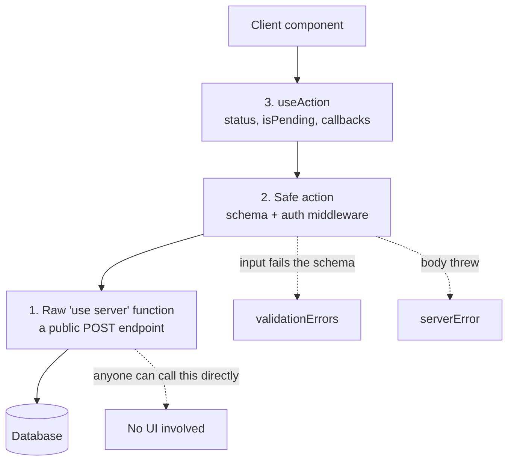

The pull request was two lines and I nearly approved it from my phone, in a queue, the way nobody should ever approve anything.

Someone had added a delete button. It called the action, ignored what came back, and moved on. No validation on the input. No check that the person clicking owned the thing they were deleting.

It was the third delete button that month, written the third different way. None of the three authors had done anything unreasonable. Each had copied the nearest example, and the examples disagreed with each other, because "server action" gets used for three different things stacked on top of one another.

Until you can name all three, you cannot tell which one an example is showing you.

## The three layers

Say them out loud once and the rest of this is easy.

**One: the raw action.** An `async` function marked [`'use server'`](https://nextjs.org/docs/app/api-reference/directives/use-server). You call it like a local function and the framework turns that into a network request. No validation, and it signals failure by throwing.

**Two: the wrapper.** A [safe action](https://next-safe-action.dev/) built on the raw one. It attaches an input schema and [middleware](term:middleware), and instead of throwing it returns a result object.

**Three: the hook.** `useAction`, which defines nothing. It calls a wrapper-built action and gives you React state while the call is in flight.

The analogy that made it stick for me: layer one is a phone line. Layer two is a receptionist who checks who is calling and writes the message down properly. Layer three is the little "connecting" light on the handset.

They are not alternatives. Each one sits on the one below.



The dotted line on the right is the one that matters. Layers two and three are yours. Layer one is reachable by anybody.

## Why the raw layer is not enough

A [server action](term:server-action) looks like a function call, so it inherits the trust you give a function call. It should not.

It is a POST endpoint. Anyone can call it with any payload, from anywhere, with no UI involved. So two things are permanently your job: validating the input, and deciding whether this caller is allowed.

The Next.js team [say this directly](https://nextjs.org/blog/security-nextjs-server-components-actions): an action is a public entry point, and the fact that only one component imports it is not a security boundary. Nothing stops a request arriving without that component ever rendering.

The throwing part is the other half:

```tsx
// Raw action. Every failure is an exception, so every caller
// needs a try/catch or the page breaks on a bad email address.
'use server';
export async function invite(email: string) {
  if (!email.includes('@')) throw new Error('Bad email');
  await db.insert(invites).values({ email });
}
```

A typo in an email address is not an exceptional condition. It is the single most ordinary thing a form produces. Routing it through exceptions means the expected path and the broken path share machinery, and the compiler cannot tell you which failures are possible.

## What the wrapper actually buys

You define one client, once, and every mutation goes through it. The schema can come from [Zod](https://zod.dev/) or anything else the library adapts, and it runs on the server before your code sees the input:

```ts
// One place that knows how auth works.
export const authedAction = createSafeActionClient()
  .use(async ({ next }) => {
    const user = await getSession();
    if (!user) throw new Error('Not signed in');
    return next({ ctx: { user } });
  });
```

Then a mutation is a schema plus a body, and it cannot skip either:

```ts
export const invite = authedAction
  .inputSchema(z.object({ email: z.string().email() }))
  .action(async ({ parsedInput, ctx }) => {
    await db.insert(invites).values({
      email: parsedInput.email,
      invitedBy: ctx.user.id,
    });
    return { ok: true };
  });
```

Calling that returns a [discriminated union](term:discriminated-union): `data`, `validationErrors`, or `serverError`. You branch on it. No `try/catch`, because a bad email stopped being an exception and became a value.

The real win is not ergonomics. It is that a component **cannot accidentally skip the auth check**, because the check lives in the client that built the action rather than in the component that calls it. Correctness by construction beats correctness by review, especially at 6pm on a Friday.

## Where the hook fits

The hook is only about consuming. This is the sentence that clears up most of the confusion: **`useAction` is not a way to define an action, it is a way to call one.**

Called directly, you own the lifecycle:

```tsx
const res = await invite({ email });
if (res.data) toast.success('Invited');
else if (res.serverError) toast.error(res.serverError);
// and you track loading, and reset it, and handle unmount
```

Called through the hook, the lifecycle is state:

```tsx
const { execute, isPending } = useAction(invite, {
  onSuccess: () => toast.success('Invited'),
  onError: ({ error }) => toast.error(error.serverError ?? 'Failed'),
});
```

The hooks live at `next-safe-action/hooks`, a separate entry point, so server code never pulls React hooks into its bundle. That split is deliberate and worth copying in your own libraries.

Direct calls are fine from a [server component](https://react.dev/reference/rsc/server-components) or a one-off. Anything with a button and a spinner wants the hook.

## Where the wrapper stops

Have this ready when an interviewer pushes, because it is where people overclaim.

The wrapper validates **shape**, not **permission**. A schema proves `orderId` is a UUID. It says nothing about whether this user may cancel that order. Ownership checks belong in the action body, against the session in `ctx`, and no schema will ever do them for you. Skipping that is [insecure direct object reference](term:idor), which has sat in the [OWASP top ten](https://owasp.org/www-project-top-ten/) for two decades under one name or another.

It also does not make the endpoint private. The action is still reachable by anyone who can form a request, so an action built from an unauthenticated client is public however deeply nested the component that calls it.

I got this wrong on this site. An action took a visitor id as an argument, which meant anyone who saw an id could delete that visitor's comments. The fix was to read identity from the cookie on the server and never accept it as input. A schema would have validated the attacker's id perfectly happily.

## The short version

- A raw action is a public POST endpoint with no validation that throws on failure. Treat every argument as hostile.
- The wrapper adds a schema, [middleware](https://next-safe-action.dev/docs/guides/middleware) and a typed result, so expected failures become values you branch on instead of exceptions you catch.
- Define one auth-wrapped client and route every mutation through it, so a component cannot skip the check.
- [`useAction`](https://next-safe-action.dev/docs/guides/hooks) consumes an action, it does not define one. Reach for it wherever there is a button and a spinner.
- Schemas validate shape, not permission. Ownership checks go in the action body, against the session, every single time.
