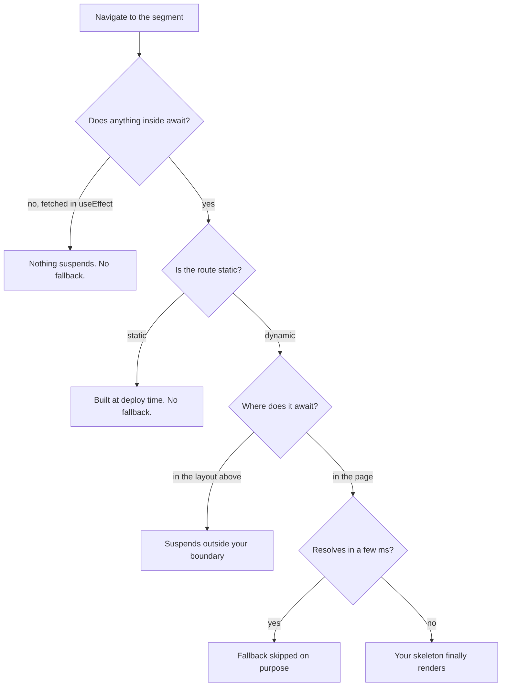

The skeleton took an afternoon. Right shape, right rounded corners, a shimmer tuned close enough to the real table that you would not catch the swap.

It went in `app/orders/[id]/loading.tsx`, exactly where the docs say to put it.

Nobody ever saw it. Not in development, not in production, not with the network throttled to 3G and a breakpoint on the fetch. For two weeks I assumed I had misspelled something.

The file was correct. It was never going to render, and it took four separate discoveries to work out why. Each one is a different bug wearing the same costume.

## What the file actually is

`loading.tsx` is not a loading screen. It is one thing, and everything below follows from knowing it:

> Next wraps your [segment](term:segment) in a `<Suspense>` and uses this file as the fallback.

That is the whole feature. It is [sugar for a Suspense boundary](https://nextjs.org/docs/app/api-reference/file-conventions/loading) you could write by hand.

So "why does my skeleton not show" is really "why is this boundary never triggered", and a boundary triggers on exactly one condition: something inside it [suspends](term:suspend).

The ordinary version: a waiter takes your order to the kitchen, and the bread on the table is what you look at while you wait. If the kitchen is ready before the waiter turns around, no bread appears. Nothing is broken. There was no wait to fill.



Four ways down that tree end in nothing. Only one ends in your file.

## Reason one: nothing in the segment waits

Ours was this one. The page component did not await anything.

The data was fetched in a client component underneath, in a `useEffect`, into `useState`. That is a perfectly ordinary React data fetch and it is completely invisible to Suspense. The server had nothing to wait for, rendered immediately, and the boundary never fired.

```tsx
// Never suspends. React has no idea this is pending.
useEffect(() => {
  fetch(`/api/orders/${id}`).then(setOrder);
}, [id]);
```

The fix is to move the fetch into the server component and `await` it, which is what [the data fetching guide](https://nextjs.org/docs/app/getting-started/fetching-data) has recommended by default for a while now. Then the segment genuinely suspends and the skeleton has a reason to exist.

Worth internalising beyond skeletons. An [effect](https://react.dev/reference/react/useEffect) that sets state runs after paint, so the first render always shows the empty state, and you get [layout shift](term:layout-shift) for free. React's own guidance is [that most data fetching does not belong in an effect](https://react.dev/learn/you-might-not-need-an-effect); the dead skeleton is just the clearest symptom.

## Reason two: the route is static

If a route has no request-dependent inputs, Next renders it at build time. There is no per-request work, so there is nothing to wait for when somebody visits.

This one catches people in development, because a [static route](term:static-route) still feels like it is loading the first time. It is not loading. It is downloading.

The tell is in the build table that [`next build`](https://nextjs.org/docs/app/api-reference/cli/next) prints: `○` static, `ƒ` dynamic on demand. If the route you wrote a skeleton for is marked static, the skeleton is dead code.

Reading that table is a habit worth forming, because it also catches the opposite and much more expensive failure: one stray [`cookies()`](https://nextjs.org/docs/app/api-reference/functions/cookies) call marking a route dynamic and quietly dropping it off the CDN.

## Reason three: the await is above the boundary

This one is quiet, and it is the one to remember, because the code looks right.

A `loading.tsx` wraps its own segment. It does not wrap the layout above it. If the slow `await` lives in `app/orders/layout.tsx`, the layout suspends **outside** the boundary your skeleton provides, so what fires is the parent's fallback, or nothing:

```tsx
// app/orders/layout.tsx
export default async function Layout({ children }) {
  const org = await getOrg();          // blocks here
  return <Shell org={org}>{children}</Shell>;
}
```

The reader stares at the previous page while that resolves. Your skeleton is one level down, waiting patiently for a render that has not begun.

Move per-request work down into the page, or wrap the slow part in its own `<Suspense>` inside the layout. The general principle: **the boundary has to be above the thing that waits, and below the thing that should stay on screen.**

## Reason four: it is fast enough not to bother

React does not show a fallback for a boundary that resolves almost immediately. A skeleton that flashes for 30ms is worse than none, so it is deliberately avoided.

If your local database answers in two milliseconds you may never see the file work locally, then see it constantly in production where the same query crosses a region. Throttling the network will not reproduce it, because the wait is on the server, not the wire. Put a deliberate delay in the server component if you need to prove the file works at all.

## Where loading.tsx stops being the right tool

It is per segment, and that is its real limit.

`loading.tsx` blanks the **whole** segment. If your page has a header, a summary and one slow table, it replaces all three, including the two that were ready instantly. That is actively worse than nothing: you are hiding fast content behind slow content.

The moment two things on a page have different speeds, you want boundaries inside the page:

```tsx
export default function Page() {
  return (
    <>
      <OrderHeader />                       {/* instant, never hidden */}
      <Suspense fallback={<TableSkeleton />}>
        <OrderLines />                      {/* slow, streams in */}
      </Suspense>
    </>
  );
}
```

Now the shell paints at once and only the slow region shows a placeholder, which is what [streaming](https://react.dev/reference/react/Suspense) was for. It is also the direction the framework itself is heading, where a [static shell ships immediately and dynamic holes fill in](https://nextjs.org/docs/app/getting-started/caching).

The other boundary is the one from the prefetch story: this file makes navigation *feel* instant. It does nothing to how long the data takes. If the table needs two seconds, the skeleton is on screen for two seconds, and the fix for that lives on the server.

## The short version

- `loading.tsx` is a `<Suspense>` around the segment. It fires when something inside [suspends](https://react.dev/reference/react/Suspense), and never otherwise.
- Fetching in `useEffect` does not suspend. Move the await into the server component.
- Static routes have nothing to wait for. Check `○` against `ƒ` in the build output.
- An await in the layout suspends above your boundary, so your skeleton never gets a turn.
- Very fast resolutions skip the fallback on purpose, so a fast local database can hide a real production wait.
- One slow region on an otherwise fast page wants a `<Suspense>` in the page, not a whole-segment skeleton.
